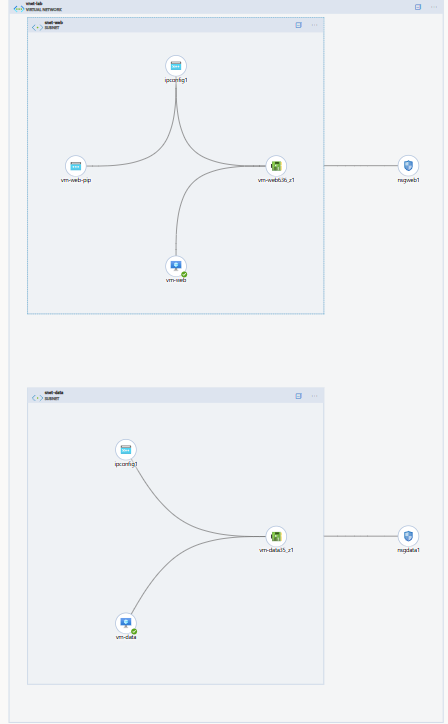
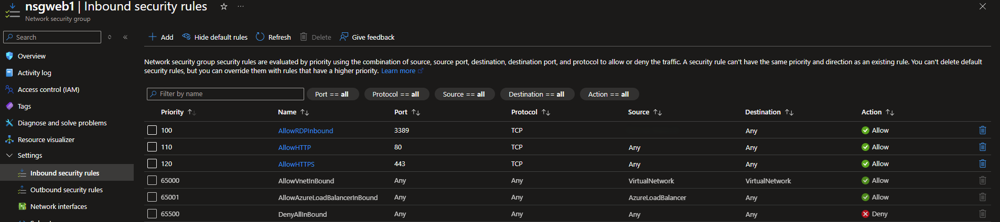
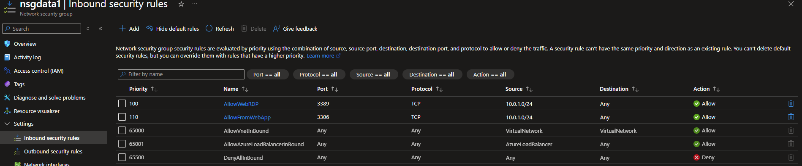

# Two-Tier VNet Segmentation Lab

## What this is

A small lab I built while studying for AZ-104. I wanted to build a segmented network instead of just reading about NSGs and hoping it stuck — so I put up a web-facing VM and a data VM, and locked the data one down so only the web tier could talk to it.

## Setup

- **VNet:** `vnet-lab` (`10.0.0.0/16`)
- **snet-web** (`10.0.1.0/24`) — `vm-web`, has a public IP
- **snet-data** (`10.0.2.0/24`) — `vm-data`, no public IP at all

`nsg-web` only allows RDP in from my own IP, plus HTTP/HTTPS from the internet. `nsg-data` only trusts RDP coming from the web subnet's address range — nothing else gets in.

## NSG rules

**nsg-web**

| Priority | Name | Source | Destination | Port | Protocol | Action |
|---|---|---|---|---|---|---|
| 100 | AllowRDPInbound | `<My Public IP>/32` | Any | 3389 | TCP | Allow |
| 110 | AllowHTTP | Any | Any | 80 | TCP | Allow |
| 120 | AllowHTTPS | Any | Any | 443 | TCP | Allow |

**nsg-data**

| Priority | Name | Source | Destination | Port | Protocol | Action |
|---|---|---|---|---|---|---|
| 100 | AllowWebRDP | `10.0.1.0/24` | Any | 3389 | TCP | Allow |
| 110 | AllowFromWebApp | `10.0.1.0/24` | Any | 3306 | TCP | Allow |

Everything else gets caught by the default deny rule. No exceptions carved out for convenience.

## What I took away from this

- How subnetting actually works when you're not just reading about CIDR ranges
- Writing NSG rules with a deny-by-default mindset instead of bolting on restrictions after the fact
- Basic separation between what's public-facing and what shouldn't be
